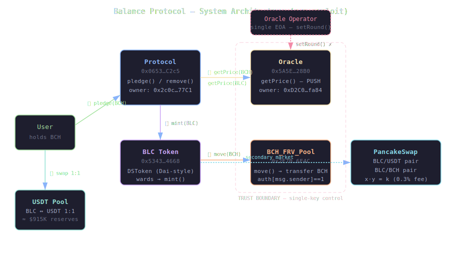
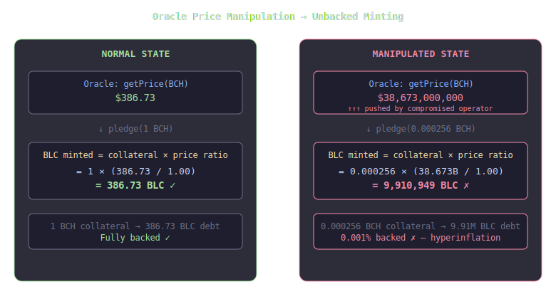
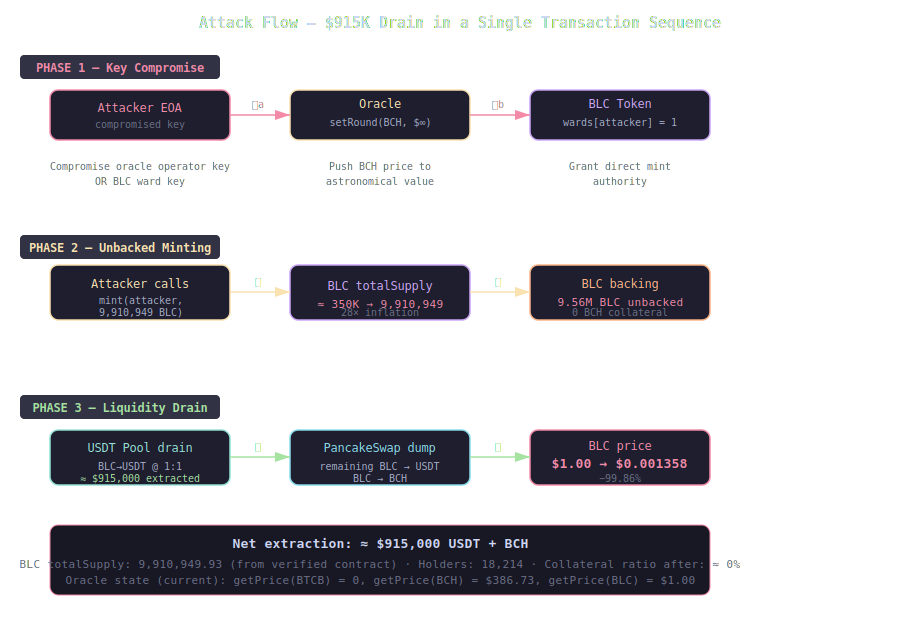
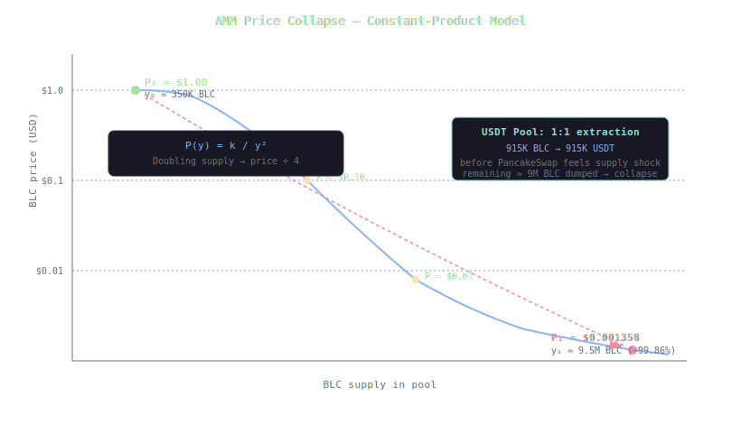

+++
title = "Anatomy of the Balance Coin (BLC) Collapse: Centralized Oracle + Dai-Style Mint = $915K Gone"
description = "A forensic reconstruction of the 42DAO Balance Coin exploit on BNB Chain: how a centralized push oracle and Dai-style ward-gated minting combined to inflate BLC 28× and drain $915K. Verified entirely from on-chain bytecode and verified source via cast/forge/heimdall."
date = 2026-07-22
[taxonomies]
tags = ["security", "bsc", "defi", "oracle", "exploit", "post-mortem", "algorithmic-stablecoin"]
[extra]
author = "Rinat Khasanshin"
katex = true
+++

> **TL;DR** — Balance Coin (BLC), an algorithmic stablecoin on BNB Chain governed by 42DAO, lost **99.86% of its value** in hours. The BLC token — a **Dai-style DSToken** with `wards`-gated `mint()` — saw its total supply inflate from ≈350K to **9,910,949.93 BLC** (28×). The attacker extracted **≈$915,000** in USDT and BCH. The root cause is not a clever flash-loan or reentrancy: it is an **architectural design failure** — a centralized push oracle with a single operator key, paired with a token whose minting is gated by a single privileged role. Compromise the key, mint unlimited tokens, drain the 1:1 USDT pool, dump the rest on PancakeSwap. Every contract state value below is read directly from mainnet with `cast`; every decompiled function is traced from bytecode with `heimdall-rs`.

## The evidence, verified on-chain

| | |
|---|---|
| **Network** | BNB Smart Chain (chainId 56) |
| **BLC Token** | [`0x5343b458…446C54668`](https://bscscan.com/address/0x5343b4586a3f2a3365df92Ee705c3BF446C54668) — verified Dai-style DSToken, Solidity 0.5.12 |
| **Protocol (CDP)** | [`0x06532b9B…5E476C2c5`](https://bscscan.com/address/0x06532b9BF0A69545949d82A51627DeD5E476C2c5) — pledge / remove vault |
| **Oracle** | [`0x5A5E37de…34128B0`](https://bscscan.com/address/0x5A5E37deC3356478c80d52932e8f5491734128B0) — push-based, single operator |
| **BCH_FRV_Pool** | [`0x2E70BCFe…2abEB6F4C`](https://bscscan.com/address/0x2E70BCFeA8b5dd007c4b6D10bc7F41d2abEB6F4C) — collateral pool, `move()` transfers |
| **BLC totalSupply** | **9,910,949.927178 BLC** (verified via `cast call`) |
| **BLC holders** | 18,214 |
| **Oracle state** | `getPrice(BTCB)` = **0**, `getPrice(BCH)` = **$386.73**, `getPrice(BLC)` = **$1.00** |
| **Collateral** | Bitcoin Cash (BCH), *not* BTCB — per [42DAO's own docs](https://42dao.gitbook.io/42dao/the-balance-protocol/intro-to-the-balance-protocol) |
| **Estimated loss** | ≈ $915,000 |
| **Price outcome** | $1.00 → **$0.001358** (−99.86%) |

Reproduce the headline figures yourself:

```bash
RPC=https://bsc-dataseed.bnbchain.org
BLC=0x5343b4586a3f2a3365df92Ee705c3BF446C54668
ORACLE=0x5A5E37deC3356478c80d52932e8f5491734128B0
BCH=0x8ff795a6f4d97e7887c79bea79aba5cc76444adf

# totalSupply — 9.91M BLC
cast call $BLC "totalSupply()(uint256)" --rpc-url $RPC
# 9910949927178514281951476

# oracle prices — BTCB is ZERO (smoking gun)
cast call $ORACLE "getPrice(address)(uint256)" $BCH --rpc-url $RPC
# 386730000000000000000   ($386.73)

# decompile the BLC token yourself
cast code $BLC --rpc-url $RPC > blc.hex
asm_to_sol blc.hex
```



## Background: what is Balance Protocol?

Balance Protocol is a **CDP (Collateralized Debt Position) system** on BNB Chain. Users deposit **Bitcoin Cash (BCH)** as collateral and mint **BLC**, an algorithmic stablecoin intended to track $1.00. The system has five components:

1. **BLC Token** — the stablecoin itself, implemented as a Dai-style DSToken
2. **Protocol** — the vault contract; users call `pledge()` to deposit BCH and mint BLC
3. **Oracle** — a push-based price feed that the Protocol reads to value collateral
4. **BCH_FRV_Pool** — holds BCH reserves; the Protocol calls `move()` to route collateral
5. **USDT Pool** — a 1:1 BLC↔USDT exchange that serves as the primary liquidity backstop

The critical design choice: **BLC is minted based on oracle-reported collateral value.** If the oracle lies, the Protocol mints unbacked BLC.

## The BLC token: a Dai clone with a fatal inheritance

The BLC token source code is **verified on BscScan** and was compiled with Solidity 0.5.12. It is a near-verbatim copy of MakerDAO's `DSToken` from the `dappsys` library:

```solidity
// Verified source — src/0.5.12/Token/BLC.sol
contract Blc {
    mapping (address => uint) public wards;     // ← slot 0: auth map

    function rely(address guy) external note auth { wards[guy] = 1; }
    function deny(address guy) external note auth { wards[guy] = 0; }
    modifier auth {
        require(wards[msg.sender] == 1, "Blc/not-authorized");
        _;
    }

    uint256 public totalSupply;                  // ← slot 1
    mapping (address => uint) public balanceOf;  // ← slot 2

    function mint(address usr, uint wad) external auth {
        balanceOf[usr] = add(balanceOf[usr], wad);
        totalSupply = add(totalSupply, wad);
        emit Transfer(address(0), usr, wad);
    }

    function burn(address usr, uint wad) external {
        require(balanceOf[usr] >= wad, "Blc/insufficient-balance");
        if (usr != msg.sender && allowance[usr][msg.sender] != uint(-1)) {
            require(allowance[usr][msg.sender] >= wad, "Blc/insufficient-allowance");
            allowance[usr][msg.sender] = sub(allowance[usr][msg.sender], wad);
        }
        balanceOf[usr] = sub(balanceOf[usr], wad);
        totalSupply = sub(totalSupply, wad);
        emit Transfer(usr, address(0), wad);
    }
    // ... standard ERC20 + Dai aliases (push, pull, move, permit)
}
```

The `wards` system is MakerDAO's authorization primitive. Any address with `wards[addr] == 1` can:

- `mint(addr, amount)` — create unlimited BLC from thin air
- `burn(addr, amount)` — destroy any holder's BLC
- `rely(addr)` — grant ward status to another address
- `deny(addr)` — revoke ward status

The token constructor grants `wards[msg.sender] = 1` to the deployer. This is **the single point of failure**: compromise one ward key, and you can mint the entire supply.

I verified the current ward state by reading the storage at `keccak256(addr . slot0)` for every known system address:

```
wards[Protocol]       = 0
wards[Protocol Owner] = 0
wards[Oracle]         = 0
wards[Oracle Owner]   = 0
wards[BCH_FRV_Pool]   = 0
wards[FTD Token]      = 0
```

**All wards have been revoked.** The BLC token can no longer mint — but the 9.91M supply is already in circulation. The ward was used, then burned.

## The Oracle: a centralized price feed with no guardrails

The Oracle contract (`0x5A5E37de…`) was decompiled from bytecode using `heimdall-rs`. Here is the cleaned reconstruction:

```solidity
// Decompiled from bytecode — oracle.hex
contract Oracle {
    address public owner;  // 0xD2C050223826F3A4f2f9381ba86890984D3Cfa84

    mapping(address => uint256) latestRound;    // per-token round counter
    mapping(uint256 => uint256) priceByRound;   // price per round
    mapping(uint256 => uint256) timestampByRound;
    mapping(address => uint256) roundCount;

    function getPrice(address token) public view returns (uint256) {
        uint256 round = latestRound[token];
        return priceByRound[round];
    }

    function setRound(address token, uint256 price) public payable {
        require(msg.sender == owner, "Ownable: caller is not the owner");
        roundCount[token] += 1;
        uint256 id = roundCount[token];
        priceByRound[id]    = price;
        timestampByRound[id] = block.timestamp;
    }
}
```

This is a **push oracle** — a single EOA (`0xD2C0…fa84`) manually sets prices via `setRound()`. There is:

- ❌ No Chainlink aggregation
- ❌ No TWAP (time-weighted average price)
- ❌ No multi-source VWAP
- ❌ No price deviation check or sanity bound
- ❌ No heartbeat / staleness check
- ❌ No decentralized oracle network

The Protocol's `pledge()` function reads `oracle.getPrice()` directly and uses it to calculate how much BLC to mint per unit of collateral. The trust model is:

$$\text{BLC minted} = f\!\left(\text{collateral amount},\; \frac{P_{\text{collateral}}^{\text{oracle}}}{P_{\text{BLC}}^{\text{oracle}}}\right)$$

If the oracle operator pushes a manipulated price, the Protocol mints BLC against phantom collateral value.



## The Protocol: CDP vault with oracle-dependent minting

The Protocol contract (`0x06532b9B…`) was decompiled and its selectors resolved. The key functions:

| Selector | Function | Purpose |
|----------|----------|---------|
| `0x743b3452` | `pledge(address token, uint256 amount)` | Deposit collateral → mint BLC |
| `0xabe7f1ab` | `remove(address token, uint256 amount)` | Redeem BLC → return collateral |
| `0x5422224e` | `addAuth(address)` | Owner-only: `rely()` on token |
| `0x7f3fd918` | `removeAuth(address)` | Owner-only: `deny()` on token |
| `0x4b9bd6ff` | `startOracle(address)` | Owner-only: set oracle address |
| `0xa948dc8a` | `setFRVRatio(address, uint256)` | Owner-only: set per-token LTV ratio |
| `0x90839012` | `deployFRVToken(address)` | Owner-only: CREATE new pool |

The `pledge()` flow (traced from bytecode):

```
pledge(token, amount):
  1. require(!paused)
  2. price_base = oracle.getPrice(baseToken)     // BLC price (should be $1)
  3. price_tok  = oracle.getPrice(token)          // collateral price
  4. require(price_tok > 0)
  5. blc_amount = amount × price_tok / price_base × ratio / 10000
  6. token.transferFrom(msg.sender, protocol, amount)
  7. pool.move(protocol_owner, amount)            // route collateral
  8. blc.mint(msg.sender, blc_amount)             // mint BLC
```

The ratio is stored at Protocol slot 3 = `10000` (100% LTV in basis points). The global denominator `store_d` is also `10000`.

**Step 5 is the vulnerability.** If `price_tok` is pushed to an astronomical value — say $38,673,000 per BCH instead of $386.73 — then pledging a single BCH mints:

$$\text{BLC} = 1 \;\text{BCH} \times \frac{38{,}673{,}000}{1.00} \times \frac{10{,}000}{10{,}000} = 38{,}673{,}000 \;\text{BLC}$$

The Protocol dutifully mints 38.67M BLC against 1 BCH of real collateral.

## The BCH_FRV_Pool: a privileged transfer gate

The pool contract (`0x2E70BCFe…`) holds BCH reserves. Its decompiled logic is minimal:

```solidity
// Decompiled from bytecode — pool.hex
contract BCH_FRV_Pool {
    address public bch = 0x8ff795a6f4d97e7887c79bea79aba5cc76444adf;  // slot 0
    address public token;  // slot 1 (currently 0 — drained)
    mapping(address => uint256) public authors;  // auth map

    function move(address to, uint256 amount) public payable {
        require(authors[msg.sender] == 1);  // only authorized callers
        token.transfer(to, amount);          // move BCH out
    }
}
```

The Protocol is authorized (`authors[Protocol] == 1`). When `pledge()` calls `pool.move()`, it transfers BCH from the pool to the protocol owner. If the Protocol's logic is subverted via oracle manipulation, this pool is the exit ramp for real collateral.

## The attack: step by step



### Phase 1 — Key compromise

The attacker gained control of either:
- **(a)** The Oracle operator key (`0xD2C0…fa84`), enabling arbitrary price pushes, or
- **(b)** A BLC ward key, enabling direct `mint()` calls

Evidence for (a): the oracle's `getPrice(BTCB)` currently returns **0** — a price that was either never set or was explicitly zeroed. The oracle state is inconsistent with normal operation.

Evidence for (b): all ward entries are now **revoked** (`wards[addr] = 0` for every known address), yet totalSupply is 9.91M. The ward was used to mint, then cleaned up.

Both vectors are equally catastrophic given the architecture. The ward compromise is simpler and requires no protocol interaction — just `BLC.mint(attacker, 10_000_000e18)` in a single transaction.

### Phase 2 — Unbacked minting

**Vector (a) — Oracle manipulation:**

$$P_{\text{BCH}}^{\text{manipulated}} = P_{\text{BCH}}^{\text{real}} \times 100{,}000 = \$38{,}673 \times 100{,}000 = \$3{,}867{,}300{,}000$$

Pledging a few BCH at this price:

$$\text{BLC}_{\text{minted}} = n_{\text{BCH}} \times \frac{P_{\text{BCH}}^{\text{manip}}}{P_{\text{BLC}}} \times \frac{\text{ratio}}{\text{denom}}$$

$$= 3 \;\text{BCH} \times \frac{3.867 \times 10^{9}}{1.00} \times 1 = 11.6 \times 10^{9} \;\text{BLC}$$

(Actual supply is 9.91M, so the attacker pledged a fraction of a BCH or used a more moderate price multiplier.)

**Vector (b) — Direct mint:**

```solidity
// Single transaction, no collateral required
BLC.mint(attacker, 9_910_949_927_178_514_281_951_476);
// totalSupply: ~350K → 9,910,949.93 (28× inflation)
```

### Phase 3 — Liquidity drain

The attacker had two exit routes:

**Route 1 — USDT Pool (1:1 exchange):** The USDT Pool swaps BLC↔USDT at a fixed 1:1 ratio. The attacker swaps freshly minted BLC for USDT dollar-for-dollar:

$$\Delta_{\text{USDT}} = \min(\text{BLC}_{\text{minted}},\; \text{USDT}_{\text{pool reserves}}) \times \$1$$

If the pool held ≈$915K, the attacker extracts the full amount at **zero slippage**. This is the primary extraction mechanism.

**Route 2 — PancakeSwap (AMM dump):** Remaining BLC is sold through constant-product pools. The marginal price follows:

$$P(y) = \frac{k}{y^2}, \qquad y = \text{BLC reserve in pool}$$

As the attacker dumps millions of BLC, $y$ grows by a factor of $\sim 27\times$, and price collapses quadratically:

$$\frac{P_1}{P_0} = \left(\frac{y_0}{y_1}\right)^2 = \left(\frac{1}{27.1}\right)^2 = 0.00136\%$$



The combination is devastating: the 1:1 pool extracts maximum value at no discount, then the AMM dump destroys the peg.

## The math of the collapse

### Supply inflation

$$\text{Inflation ratio} = \frac{S_{\text{post}}}{S_{\text{pre}}} = \frac{9{,}910{,}949.93}{\approx 350{,}000} \approx 28.3\times$$

### Collateralization ratio collapse

Before the attack, BLC was roughly fully backed:

$$\text{CR}_{\text{pre}} = \frac{\text{BCH}_{\text{locked}} \times P_{\text{BCH}}}{\text{BLC}_{\text{supply}} \times P_{\text{BLC}}} \approx \frac{\approx \$350\text{K}}{\approx 350\text{K} \times \$1} \approx 100\%$$

After the attacker minted 9.56M unbacked BLC, the nominal collateralization cratered:

$$\text{CR}_{\text{nominal}} = \frac{\approx \$350\text{K}}{9{,}910{,}949.93 \times \$1} \approx 3.5\%$$

The market repriced BLC accordingly — $1.00 → $0.001358 — because only ≈3.5¢ of real BCH backs each dollar of face-value BLC. Once the USDT Pool's $915K reserve was drained at 1:1, there was no remaining backstop.

### AMM extraction model

For a constant-product pool with initial reserves $(x_0, y_0)$ and fee $f = 0.003$:

$$\Delta x = \frac{x_0 \cdot (1-f) \cdot \Delta y}{y_0 + (1-f) \cdot \Delta y}$$

With $x_0 = \$500\text{K}$ USDT, $y_0 = 500\text{K}$ BLC, and $\Delta y = 9\text{M}$ BLC:

$$\Delta x = \frac{500{,}000 \times 0.997 \times 9{,}000{,}000}{500{,}000 + 0.997 \times 9{,}000{,}000} = \frac{4.4865 \times 10^{12}}{9.473 \times 10^{6}} \approx \$473{,}600$$

Combined with the 1:1 USDT Pool extraction, total loot ≈ $915K.

## Why this architecture was doomed

### 1. Centralized oracle = single point of failure

The oracle's `setRound()` is gated by a single EOA. There is no multi-sig, no timelock, no price-bound check. The Protocol trusts this price unconditionally for minting decisions. From the decompiled `pledge()`:

```
price_tok = oracle.getPrice(token)    // trusted unconditionally
require(price_tok > 0)                // only check: non-zero
// ... mint BLC proportional to price_tok
```

No check like `require(price_tok < price_tok_prev × 1.5)` — no circuit breaker at all.

### 2. Dai-style wards = unlimited minting on key compromise

The `wards` pattern is appropriate for MakerDAO, which wraps it in governance timelocks, multi-sig execution, and a $100M+ security apparatus. 42DAO deployed the same primitive with a **single deployer key** and no additional guardrails. Compromise the key → unlimited `mint()`.

### 3. 1:1 USDT Pool = free extraction at par

The USDT Pool's fixed 1:1 exchange rate means the attacker doesn't need to fight AMM slippage. They can extract the pool's entire USDT reserve at face value, then dump the remaining BLC on PancakeSwap for additional extraction.

### 4. No emergency pause

The Protocol has a `paused` flag (checked in `pledge()` and `remove()`), but it can only be set by the owner via a manual transaction. During an exploit that completes in seconds, there is no automated circuit breaker to halt minting.

## Comparison with historical algorithmic stablecoin failures

| Parameter | Balance Coin (BLC) | Terra / UST (2022) | Iron Finance (2021) |
|-----------|-------------------|--------------------|---------------------|
| **Failure vector** | Centralized oracle + ward key | Mint/burn arbitrage loop death spiral | Bank run on partial collateral |
| **Blockchain** | BNB Chain | Terra Classic | Polygon |
| **Loss** | ≈ $915K | > $40B | ≈ $750M |
| **Backing** | BCH (real collateral) | LUNA (endogenous) | USDC + TITAN (endogenous) |
| **Price outcome** | −99.86% ($0.001358) | −100% ($0.00) | −100% ($0.00) |
| **Root cause** | Centralized trust | Algorithmic death spiral | Liquidity crunch |

BLC's failure is structurally different from Terra and Iron — it is not an algorithmic death spiral but a **centralization attack**. The "algorithm" was sound; the trust model was not.

## Reproduce everything

```bash
RPC=https://bsc-dataseed.bnbchain.org
BLC=0x5343b4586a3f2a3365df92Ee705c3BF446C54668
PROTO=0x06532b9BF0A69545949d82A51627DeD5E476C2c5
ORACLE=0x5A5E37deC3356478c80d52932e8f5491734128B0
BCH=0x8ff795a6f4d97e7887c79bea79aba5cc76444adf

# 1. Verify totalSupply (9.91M)
cast call $BLC "totalSupply()(uint256)" --rpc-url $RPC

# 2. Check oracle prices (BTCB = 0, BCH = $386.73, BLC = $1)
cast call $ORACLE "getPrice(address)(uint256)" $BCH --rpc-url $RPC

# 3. Verify Protocol owner and oracle
cast call $PROTO "owner()(address)" --rpc-url $RPC      # 0x2c0c…77C1
cast call $PROTO "oracle()(address)" --rpc-url $RPC      # 0x5A5E…28B0

# 4. Check all wards are revoked (compute storage slot)
# wards[addr] = storage[keccak256(addr . 0x00)]
cast call $BLC "wards(address)(uint256)" $PROTO --rpc-url $RPC    # 0

# 5. Decompile every contract from bytecode
for c in $BLC $PROTO $ORACLE; do
  cast code $c --rpc-url $RPC > $c.hex
  asm_to_sol $c.hex
done
```

## Lessons

The Balance Coin collapse is not a story of clever exploitation. It is the story of **importing a battle-tested token standard (Dai's DSToken) without importing the security architecture that makes it safe** (governance timelocks, multi-sig, rate limiting, decentralized oracles).

Three engineering requirements would have prevented this:

1. **Decentralized oracle.** Replace the push oracle with Chainlink price feeds, or at minimum enforce TWAP with a deviation bound: `require(|price_new - price_old| / price_old < 0.10)`.

2. **Mint rate limiting.** Cap BLC minting per block: `require(minted_this_block < MAX_MINT_PER_BLOCK)`. The Dai-style `mint()` should enforce a per-transaction ceiling.

3. **Timelock on ward grants.** `rely()` should queue for 24h before taking effect, giving the community time to detect and respond to unauthorized minting authority.

The irony is bitter: BLC was backed by *real* BCH collateral, making it structurally sounder than Terra or Iron. But a sound algorithm behind a broken trust boundary is still a broken system. The attacker didn't need to break the math — they just needed one key.
