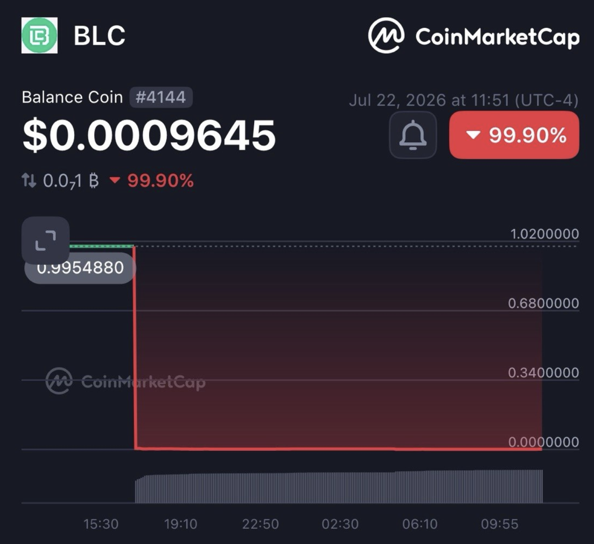
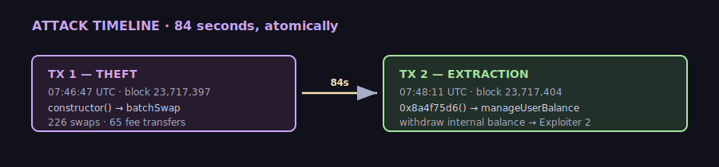
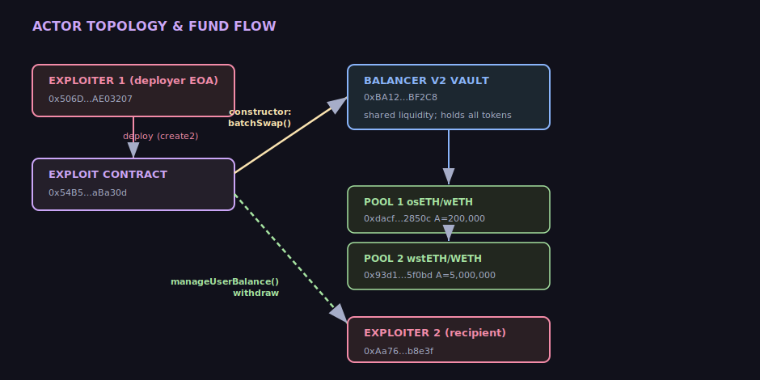
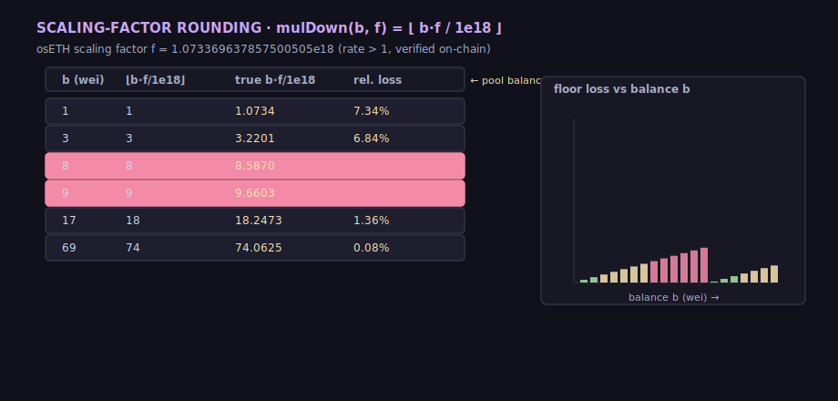
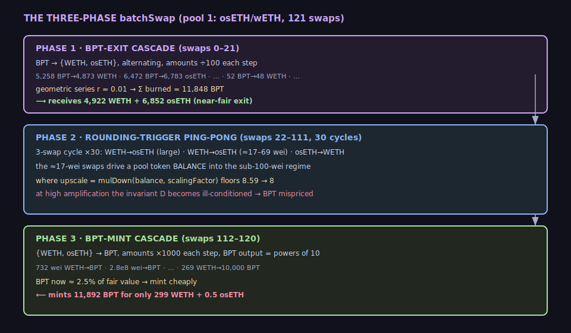
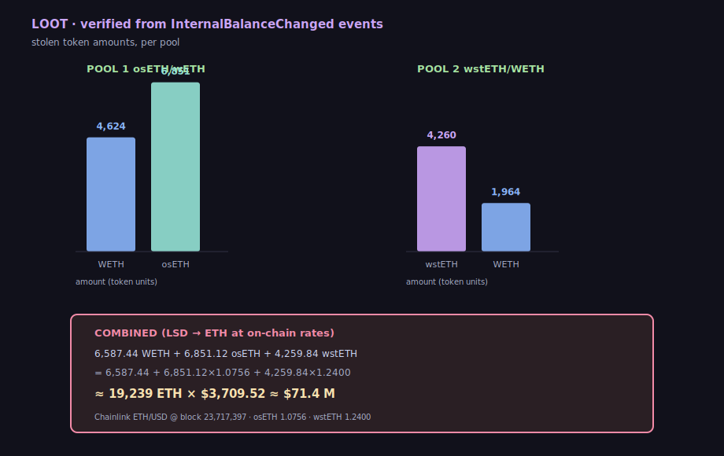

+++
title = "Anatomy of the Balancer V2 ComposableStablePool Hack (Nov 2025)"
description = "A forensic reconstruction of the $63M+ Balancer V2 exploit: how a scaling-factor rounding inconsistency in ComposableStablePool invariant math was weaponized in a 226-swap batchSwap. Verified entirely from on-chain data via cast/forge."
date = 2026-07-23
[taxonomies]
tags = ["security", "ethereum", "defi", "balancer", "exploit", "post-mortem"]
[extra]
author = "Rinat Khasanshin"
katex = true

[extra.social_media_image]
path = "cover.png"
alt_text = "Anatomy of the Balancer V2 ComposableStablePool hack — $71M drained via a 226-swap batchSwap"
+++

> **TL;DR** — On **2025-11-03 07:46:47 UTC**, a single contract-deployment transaction drained two Balancer V2 ComposableStablePools of **≈19,239 ETH** (${\approx \$71\text{M}}$ at the Chainlink spot of $\$3{,}709.52$). The constructor fired a `batchSwap` of **226 swaps** that resolved into three phases: a geometric BPT-exit cascade, a WETH↔osETH ping-pong that drives a token balance into the sub-100-wei regime, and a geometric BPT-mint cascade that re-mints the BPT for **~2.5% of fair value**. The root cause is a rounding inconsistency between the rate-based balance scaling (`mulDown`, floor division) and the invariant $D$ recomputation at high amplification. Every number below is read directly from mainnet with `cast`.



## The evidence, verified on-chain

| | |
|---|---|
| **Theft tx** | `0x6ed07db1…23bc9742` — block **23,717,397**, `07:46:47 UTC`, status ✅ |
| **Extraction tx** | `0xd1552072…5b48569` — block **23,717,404**, `07:48:11 UTC` (84 s later) |
| **Exploit contract** | `0x54B53503c0e2173Df29f8da735fBd45Ee8aBa30d` |
| **Deployer (EOA)** | `0x506D1f9EFe24f0d47853aDca907EB8d89AE03207` |
| **Recipient (EOA)** | `0xAa760D53541d8390074c61DEFeaba314675b8e3f` |
| **Pool 1** | `0xdacf5fa1…2850c` — *osETH/wETH* StablePool, $A = 200{,}000$ |
| **Pool 2** | `0x93d19926…5f0bd` — *wstETH/WETH* StablePool, $A = 5{,}000{,}000$ |
| **Swap events in tx1** | 226 (121 on pool 1, 105 on pool 2) |
| **Fee transfers** | 65 (to the Protocol Fees Collector) |
| **Net stolen** | 6,587 WETH + 6,851 osETH + 4,260 wstETH (+ 64.6 BPT scraps) |



Reproduce the headline figures yourself:

```bash
RPC=https://ethereum.publicnode.com
# both transactions succeeded
cast receipt 0x6ed07db1a9fe5c0794d44cd36081d6a6df103fab868cdd75d581e3bd23bc9742 \
  --rpc-url $RPC | grep status      # -> 1
# the two pools
cast call 0xdacf5fa19b1f720111609043ac67a9818262850c "name()(string)" --rpc-url $RPC
# -> "Balancer osETH/wETH StablePool"
# ETH spot price at the attack block (Chainlink ETH/USD, 8 decimals)
cast call 0x5f4eC3Df9cbd43714FE2740f5E3616155c5b8419 \
  "latestRoundData()(uint80,int256,uint256,uint256,uint80)" \
  --block 23717397 --rpc-url $RPC   # answer 370951870300 -> $3,709.52
```

## Background: the Vault and "composable" pools

Balancer V2 centralizes all token custody in a single **Vault** (`0xBA12…BF2C8`). Pools are stateless pricing modules; the Vault moves the bytes. Two design choices matter here.

**Internal balance.** The Vault credits each account a per-token internal balance. A `batchSwap` settles *net* deltas against internal balance at the end — so a contract can trade in circles and walk away with the net surplus, never touching ERC-20 `transfer` until it withdraws.

**Composable pools.** A ComposableStablePool lists *its own BPT* as one of the pool's tokens. Joining/leaving is expressed as ordinary swaps against BPT, and the BPT "price" is derived from the invariant $D$:

$$\text{BPT rate} \;=\; \frac{D}{\text{totalSupply}}$$

Both targeted pools are 3-token composable stables whose non-BPT tokens are **liquid-staking derivatives (LSDs)** carrying an exchange rate $> 1$:

| Pool | Tokens | Rate-bearing token | Scaling factor (on-chain) |
|------|--------|--------------------|---------------------------|
| osETH/wETH | WETH, BPT, osETH | osETH | `1.073369637857500505e18` |
| wstETH/WETH | wstETH, BPT, WETH | wstETH | `1.239655095734259789e18` |



## The vulnerability: `mulDown` eats precision

Before the invariant runs, balances are *upscaled* by their scaling factor so rate-bearing tokens enter the math at true ETH parity:

```solidity
// Balancer FixedPoint — rounds DOWN
function mulDown(uint256 a, uint256 b) internal pure returns (uint256) {
    return (a * b) / ONE;          // ONE = 1e18
}
// upscale path (simplified)
balances[i] = mulDown(balances[i], scalingFactors[i]);
```

For an 18-decimal token with no rate, `scalingFactor = 1e18` and `mulDown(b, 1e18) = b` — **exact, zero loss**. But osETH's factor is `1.07337e18`. There, floor division discards a fraction of a wei:

$$\tilde b \;=\; \text{mulDown}(b,\, f) \;=\; \left\lfloor \frac{b \cdot f}{10^{18}} \right\rfloor, \qquad f_{\text{osETH}} = 1.073369637857500505 \cdot 10^{18}$$

For a **large** balance this is rounding noise. For a balance of a **few wei** it is a 6–7% relative distortion:

| $b$ (wei) | $\lfloor b f /10^{18}\rfloor$ | true $bf/10^{18}$ | rel. loss |
|----------:|------------------------------:|------------------:|----------:|
| 1 | 1 | 1.0734 | **7.34%** |
| 8 | 8 | 8.5870 | **6.83%** |
| 9 | 9 | 9.6603 | **6.83%** |
| 17 | 18 | 18.2473 | 1.36% |
| 69 | 74 | 74.0625 | 0.08% |



A 7% distortion on 8 wei is still 8 wei — negligible against a multi-million-ETH $D$ *if the invariant were well-conditioned*. It is not.

## Why the distortion becomes catastrophic: amplification

ComposableStablePools price with the Curve-style invariant. With amplification $\mathcal{A}$ and $n$ tokens, $D$ satisfies:

$$\mathcal{A} n^{n} \sum_{i} x_i \;+\; D \;=\; \mathcal{A} n^{n} D \;+\; \frac{D^{\,n+1}}{n^{n}\prod_{i} x_i}$$

solved by Newton iteration. Two facts conspire:

1. **High $\mathcal{A}$ flattens the curve.** As $\mathcal{A} \to \infty$, the surface approaches the hyperplane $D \approx \sum x_i$ and the iteration becomes increasingly sensitive to the smallest balances.
2. **A near-zero balance is a singularity.** The term $D^{\,n+1}/\prod x_i$ blows up as any $x_i \to 0$. With one balance pinned at a handful of wei *and* a 7% upscale rounding error layered on top, the iteration converges to a $D$ that **systematically understates the true pool value** — and therefore understates the BPT rate $D/\text{supply}$.

The pool recomputes $D$ fresh on every swap. So the attack is not "steal 7% of 8 wei" — it is **"drive a balance into the ill-conditioned regime, then trade against a BPT price computed from a broken $D$."**

## Forensic reconstruction: the 226 swaps

Decoding the `Swap` events of tx1 reveals the constructor did **not** run "65 identical cycles." It ran a precise three-phase program per pool. Pool 1 (121 swaps):



**Phase 1 — BPT-exit cascade (swaps 0–21).** Twenty-two swaps, alternating `BPT→WETH` and `BPT→osETH`, each **÷100** of the previous in its series:

$$5{,}258.03 \xrightarrow{\div100} 52.58 \xrightarrow{\div100} 0.526 \xrightarrow{\div100} \cdots$$

A geometric series with ratio $r = 0.01$. Sum burned:

$$\sum_{k=0}^{10} a\,r^{k} = \frac{a}{1-r},\qquad a_{\text{WETH}} = 5258.03,\;\; a_{\text{osETH}} = 6472.01$$

$$\Rightarrow \text{BPT burned} \approx \frac{5258.03 + 6472.01}{0.99} \approx 11{,}848 \text{ BPT}$$

In return the contract receives **4,922 WETH + 6,852 osETH** — a near-fair exit at the *pre-distortion* BPT rate (≈ 1 ETH/BPT). This is the "loan": real value pulled out of the pool.

**Phase 2 — rounding-trigger ping-pong (swaps 22–111).** Thirty repetitions of a 3-swap cycle: `WETH→osETH` (large), `WETH→osETH` (**≈ 17–69 wei**), `osETH→WETH`. The micro-swap is the scalpel — 31 of them land at exactly **17 wei** of osETH output, nudging the pool's osETH balance into the sub-100-wei zone where the upscale floor and the singularity collude.

**Phase 3 — BPT-mint cascade (swaps 112–120).** Nine swaps, `{WETH,osETH}→BPT`, outputs being exact powers of ten (`1e4, 1e7, …, 1e22` wei of BPT), each step **×1000**. BPT is now priced from the broken $D$:

$$\frac{\text{underlying paid}}{\text{BPT minted}} \;\xrightarrow{\text{phase 3}}\; \approx 0.025\;\text{ETH/BPT} \quad\text{vs.}\quad \underbrace{\approx 1.04\;\text{ETH/BPT}}_{\text{phase 1 rate}} \;\; (\approx 41\times \text{ collapse})$$

The contract re-mints **11,892 BPT for only 299 WETH + 0.46 osETH** — roughly **2.5% of the Phase-1 rate**. The geometric exit of Phase 1 is "repaid" with a near-free geometric mint of Phase 3.

**Net.** BPT is roughly flat ($-44$ BPT), but the underlying from Phase 1 is never returned:

$$\underbrace{4{,}922\text{ WETH} + 6{,}852\text{ osETH}}_{\text{phase 1 (taken)}} \;-\; \underbrace{299\text{ WETH} + 0.5\text{ osETH}}_{\text{phase 3 (paid)}} \;=\; 4{,}623\text{ WETH} + 6{,}851\text{ osETH}$$

Pool 2 (wstETH/WETH, 105 swaps) repeats the same program, yielding **1,964 WETH + 4,260 wstETH**. The accounting closes exactly against the `InternalBalanceChanged` events.

## The exploit contract

The deployed bytecode decompiled (via `heimdall-rs`) to a contract with **two entry points** and a constructor that does all the stealing:

- **Constructor** — builds the `batchSwap` calldata in memory (the 226 steps are *computed*, not stored literally) and calls `vault.batchSwap(...)` against both pools, crediting the surplus to its own internal balance.
- **`0x8a4f75d6`** — the withdrawal. Gated by `require(msg.sender == _owner)`, it iterates the target pools, reads `getInternalBalance`, and pushes everything to the recipient via `manageUserBalance`:

```solidity
// decompiled & cleaned — selector 0x8a4f75d6(address[] pools)
require(msg.sender == _owner);
for (pool in pools) {
    (tokens,) = vault.getPoolTokens(pool.getPoolId());
    bals = vault.getInternalBalance(address(this), tokens);
    ops = [UserBalanceOp(WITHDRAW, tok, bal, this, RECIPIENT) for ...];
    vault.manageUserBalance(ops);
}
```

The tx2 calldata confirms it verbatim — selector `0x8a4f75d6` followed by the two pool addresses:

```
0x8a4f75d6
  0000...0020                                  // offset
  0000...0002                                  // array length = 2
  dacf5fa19b1f720111609043ac67a9818262850c     // pool 1
  93d199263632a4ef4bb438f1feb99e57b4b5f0bd     // pool 2
```

The constructor is the entire attack surface. No privileged function, no re-entrancy, no oracle manipulation — pure arithmetic, committed in the deploy transaction.

## The loot

Reading the six `InternalBalanceChanged(address,address,int256)` events (topic `0x18e1ea41…`) of tx1:

| Pool | Token | Δ (exact) |
|------|-------|----------:|
| osETH/wETH | WETH | +4,623.6015 |
| osETH/wETH | osETH | +6,851.1230 |
| wstETH/WETH | WETH | +1,963.8388 |
| wstETH/WETH | wstETH | +4,259.8435 |



Converting the LSDs to ETH at their on-chain rates ($1.0756$ for osETH, $1.2400$ for wstETH):

$$6{,}587.44 \;+\; 6{,}851.12 \times 1.0756 \;+\; 4{,}259.84 \times 1.2400 \;\approx\; 19{,}239 \text{ ETH}$$

At the Chainlink spot of $\$3{,}709.52$/ETH that is **≈ $71M**. (Press coverage rounded to ~$63M using face-value LSD accounting and a slightly lower ETH print.)

## Why audits missed it

The bug is invisible to every test that checks a swap in isolation — a single swap's rounding is sub-wei and within tolerance. It only manifests as a **cumulative, adversarial state trajectory**: a balance driven to the ill-conditioned boundary *and then* a swap priced off the resulting $D$. Three blind spots aligned:

1. **Unit tests check correctness, not trajectory.** "Does `onSwap` return the right amount for these balances?" passes. "Can a 226-step adversarial `batchSwap` drive $D$ off-conservation?" is never asked.
2. **Amplification is treated as a tuning knob.** High $\mathcal{A}$ feels safer ("tighter peg") but sharpens the singularity at $x_i \to 0$.
3. **The composable BPT makes joins/exits cheap to spin.** Flash-exit → distort → flash-mint is a one-transaction round trip with no capital requirement.

The honest fix is not "round more carefully" — it is to **assert invariant conservation** after every swap and revert if $D$ moves outside a tolerance band, plus bounds-check minimum balances before the Newton loop.

## Reproduce everything

```bash
RPC=https://ethereum.publicnode.com
# 1. confirm the contract exists and is the attacker
cast code 0x54B53503c0e2173Df29f8da735fBd45Ee8aBa30d --rpc-url $RPC | wc -c
# 2. scaling factors (the rounding source)
cast call 0xdacf5fa19b1f720111609043ac67a9818262850c \
  "getScalingFactors()(uint256[])" --rpc-url $RPC
# 3. amplification
cast call 0xdacf5fa19b1f720111609043ac67a9818262850c \
  "getAmplificationParameter()" --rpc-url $RPC
# 4. the stolen amounts — decode the receipt logs
cast receipt 0x6ed07db1a9fe5c0794d44cd36081d6a6df103fab868cdd75d581e3bd23bc9742 \
  --rpc-url $RPC
# 5. decompile the bytecode yourself
cast code 0x54B53503c0e2173Df29f8da735fBd45Ee8aBa30d --rpc-url $RPC > exploit.hex
asm_to_sol exploit.hex
```

The exploit is a masterclass in *small-errors-compounding*: a 7% rounding on 8 wei, amplified by a flat-curve singularity, repeated atomically until a $D$ that is "close enough" per-swap becomes catastrophically wrong in aggregate. The contract did nothing illegal — it called public, audited functions, in the order they were designed for, with parameters they were designed to accept. The math did the rest.
